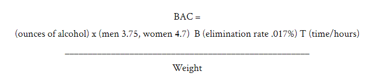

# Appalyzer

An application which implements Widmark's formula for one's blood alcohol content.

### Compile SDK version

API 27: Android 8.1 Oreo

## Built With

Android Studio 3.6.1

## Authors

* **Domagoj Bunoza**

## License

This project is licensed under the MIT License - see the [LICENSE.md](LICENSE.md) file for details
